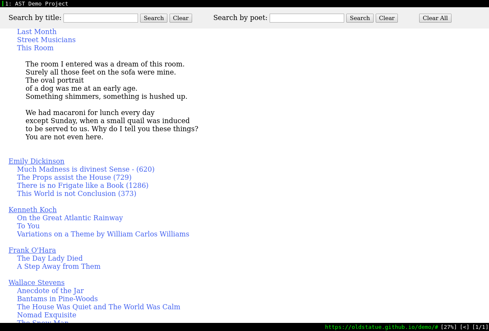

## Project overview

This project automatically generates an XML document populated with data scraped from a list of URLs, and then dynamically displays the XML data as a webpage. As an arbitrary data source, I've used the poetry website poetryfoundation.org. 

The webpage is viewable [here](https://oldstatue.github.io/demo/).

There are two main parts to this project, each handled by a separate file:

1. The shell script, [**`script.sh`**](https://github.com/oldstatue/demo/blob/master/script.sh), first downloads the pages and converts the relevant information into an XML document using Linux command line tools. It takes as input a text file with a list of URLs, which I manually compiled. It uses `curl` to download the pages, `awk` to search for and isolate the relevant text on the page, and `sed` to correctly format the text. It then writes the output to an XML document called **`data.xml`**, in which each poem is represented as a record containing author, title and content information. 

1. The webpage, [**`index.html`**](https://github.com/oldstatue/demo/blob/master/index.html), then uses JavaScript to parse the XML document into a JavaScript object, sort the lists of authors and poems, and display the data as HTML. The page also allows you to search by poem title and author name, and the JavaScript dynamically updates the HTML to match the search criteria.

The individual files are also commented throughout with more detailed explanations of how they work. 

 
